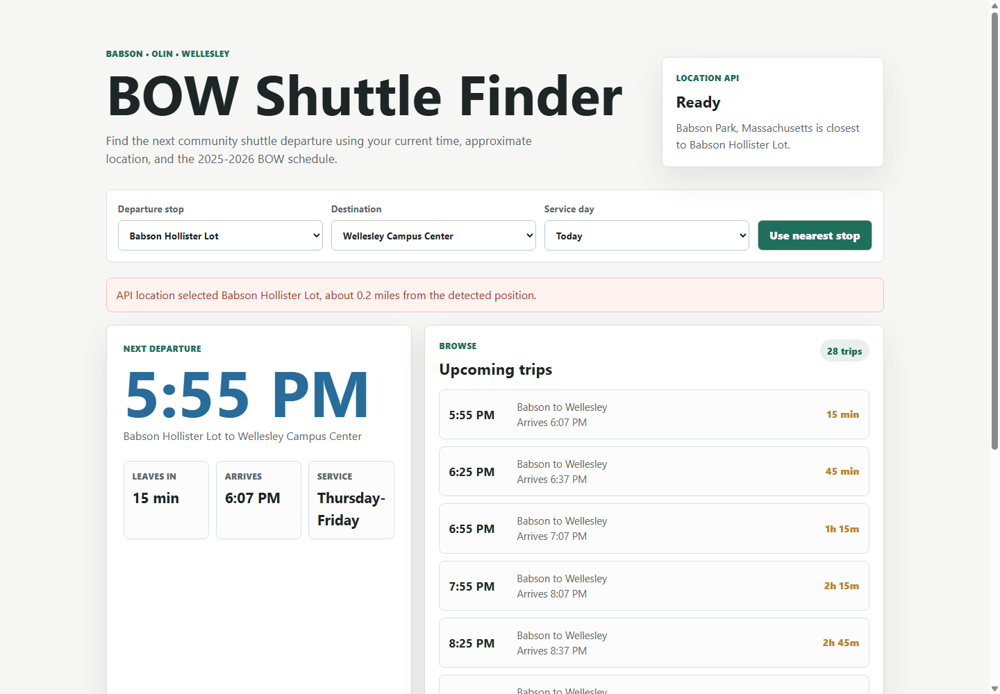

# BOW Shuttle Finder

A simple API-powered web app for finding the next Babson, Olin, and Wellesley community shuttle. The app combines the current time, approximate location, and the AY 2025-2026 BOW shuttle schedule to show the next departure and upcoming trips.

## API Used

- [Geolocation DB](https://geolocation-db.com/) for approximate location data.
- Source schedule: [AY 2025-2026 BOW Shuttle Schedule PDF](https://www.babson.edu/media/babson/assets/isss/AY-2025-2026-BOW-Shuttle-Schedule.pdf).

## Features

- Fetches live location data with `fetch()`.
- Finds the closest BOW shuttle stop.
- Shows the next departure, wait time, arrival time, and service type.
- Lets users browse by departure stop, destination, and service day.
- Includes loading, error, empty-route, and no-service states.
- Saves the latest controls with `localStorage`.
- Works as a responsive static site for GitHub Pages.

## Live Site

link tbd

## Screenshot

## What I Learned

Working with an API means planning for more than the happy path. The app needs to render while the request is loading, recover if the location API fails, and still give the user manual controls. I also learned that useful API apps often transform data instead of displaying it directly: the location coordinates become a nearest stop, and the schedule table becomes sorted upcoming route options.
