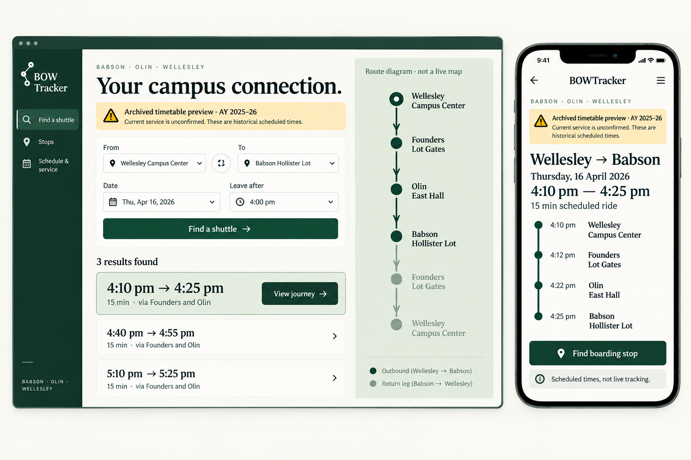

# BOWTracker

An independent shuttle planner for Babson, Olin and Wellesley, rebuilt around clear journeys and honest schedule information.

**Current-year service is unconfirmed.** As of September 22, 2026, Babson still links an AY 2025–26 PDF, while Wellesley's undated timetable disagrees on extended evenings and a midday departure. The app defaults to a source-status notice and offers an explicitly labelled archived timetable preview. It does not claim live vehicle tracking or confirmed 2026–27 departures.

## Design and scope

- [Complete overhaul outline](design/overhaul.md)
- [Official-source research and update procedure](docs/schedule-research.md)
- [Concept review and implementation decisions](design/decisions.md)
- [Image-generation prompt](design/prompt.md)
- [Verification and release status](docs/verification.md)

The two concept boards were generated and reviewed before implementation. The forest-green navigation, warm paper canvas, sage route diagram and separate journey view are implemented with native HTML/CSS, not an image background.



## Product flow

1. **Find a shuttle:** choose stops, date and leave-after or arrive-by time. Current recommendations remain unavailable until a service calendar is verified.
2. **Archived preview:** explore the AY 2025–26 timetable pattern using an explicitly illustrative date. Compare individual scheduled runs.
3. **Journey:** inspect the stop sequence and times for one run, then find your boarding stop.
4. **Stops:** open map searches or optionally request device location and confirm a nearby-origin suggestion.
5. **Schedule & service:** compare official sources, contact the operator and browse the full archived timetable.

## Accuracy model

- All service calculations use `America/New_York`, independent of the device timezone, including daylight-saving offsets.
- Trips pair downstream calls **within one timetable row**. Repeated Founders calls retain their direction. Unconfirmed through-rides across runs are never invented.
- Saturday midnight calls remain attached to Saturday's service day. Sunday searches include those post-midnight calls, but no invented Sunday starts.
- Search uses actual dates and exact boundaries; it never falls back to departed trips or copies today's timetable onto tomorrow.
- The source calls every time a departure. Destination times are labelled scheduled stop calls, not measured arrival times.
- Verified current service requires effective dates and a confirmed service calendar. Explicit cancellation/replacement-day exceptions override weekday patterns. The bundled archive deliberately has no verified validity window.
- There is no vehicle-position API. Location means the rider's optional device location, not the bus's location.

## Local development

Requires Node.js 22+ for tests and Python 3 for the simple local server.

```sh
npm ci
npm test
npm run dev
```

Open `http://localhost:3300`. The production app has no runtime package dependencies and no build step. `jsdom` is used only for in-memory interface tests. Serve over HTTP(S), not `file://`, because the app uses ES modules. Relative assets and hash routes work under the GitHub Pages repository path.

## Source layout

- `lib/schedule.js`: published AY 2025–26 rows, stop names and source metadata.
- `lib/journeys.js`: timezone conversion, service checks and pure journey searches.
- `app.js`: accessible forms, independent views, archive states and opt-in location.
- `tests/`: engine regressions and in-memory interface flow checks.

## Privacy and limitations

Route preferences are stored on this browser only; corrupt or blocked storage is tolerated. Coordinates stay in memory. IP-based location lookup has been removed. Existing stop coordinates are approximate; suggestions require confirmation and reject device accuracy worse than 500 m or a nearest stop more than 3 km away. External maps open named place searches, not asserted precise boarding pins.

No accounts, analytics, simulated bus motion, fabricated delay estimates, or automatic location request. Map links and official sources require a connection. This version does not install a service worker or guarantee offline reloads. Archived dates are examples of a timetable pattern, not proof of term or holiday operation.

## Publishing

The redesigned site is published at <https://simonjeast.github.io/bowtracker/>. Browser and mobile checks passed before the redesign was merged. Current departures remain unavailable until the source conflict is resolved and effective dates and service exceptions are confirmed.
